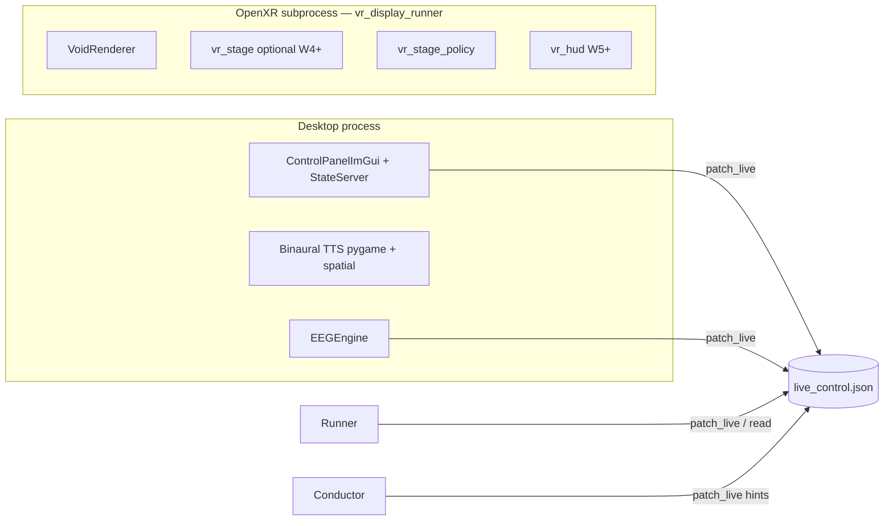

# Somna VR — Experience Design

*Rewritten after review. The previous draft was technically sound but framed VR as a
delivery problem rather than an experience problem. This document addresses both.*

---

## 1. The premise

**Somna VR should not put you somewhere. It should make the brainstate visible from inside.**

You are not in a forest, not in space, not in a generically "calming" environment. You are
inside the entrainment arc. The geometry is the session phase. The sky is theta. The
environment mirrors depth of state — it does not describe it, comment on it, or illustrate
it metaphorically. It *is* it.

This framing has real design consequences that run through every decision below. It also
means the single most important question is empirical: **does being in a headset with
Somna actually deepen the work?** We do not know yet. The first wave of implementation
exists to answer that question cheaply before building anything elaborate.

---

## 2. What VR actually changes

Before design, the honest list of what a headset adds versus a desktop display:

| What changes | Why it matters |
|---|---|
| You cannot look away | Ambient light and peripheral vision constantly break entrainment on desktop. Total field coverage changes the ceiling. |
| Spatial audio is qualitatively different | Binaural beats on headphones feel intra-cranial. The same frequencies emanating from horizon distance feel environmental. That distinction is not cosmetic. |
| Body schema destabilizes more easily | Loss of peripheral reference accelerates dissociation. The design should lean into this, not compensate for it. |
| HMD weight is present | During deep work you notice it. Everything should minimize reasons to surface from trance. |
| Vergence-accommodation conflict | Real. The instrument (full-field flicker) is less affected than detailed scene geometry. Another reason to keep geometry minimal. |

---

## 3. Design principles

| Principle | Meaning |
|---|---|
| **Environment mirrors depth, not theme** | No scenic metaphors. Geometry complexity, color temperature, and luminance follow the session arc numerically. |
| **Void is the default** | Darkness with one breathing element is more dissociative than any elaborate stage. Complexity is earned by sessions that actually need cognitive engagement. |
| **Spatial audio first** | The most meaningful VR upgrade to entrainment is audio spatialization, not visuals. It costs less and it changes the sensation categorically. |
| **Transitions register, not announce** | Phase changes shift environment by 10° color temperature or 20% geometry density. The user should not consciously notice — only find themselves further under. |
| **One boss at a time** | Combined instrument × stage × audio intensity is bounded in code. Never both channels at full simultaneously. Policy engine enforces this, not guidelines. |
| **No body** | No avatar, no hands, no spatial UI begging for attention during induction. Minimal implied presence (floor plane scale, seated reference only). |
| **Aphantasia-safe by construction** | All spatial cues are geometric and rhythmic, never imagined scenery. Void mode requires nothing from the user's visual imagination. |
| **Bus is truth** | All state remains `live_control.json` via `patch_live`. No new IPC. |

---

## 4. Runtime model

Desktop keeps audio, timeline, EEG, and the control panel. OpenXR child keeps GL + XR
session + rendering. This separation is already correct in the existing code and does not
change.

---

## 5. The experience arc

### 5.1 Descent

A session moves through phases: prelude → induction → deepening → work window → emergence.
The environment tracks depth, not clock time. The conductor already knows the phase;
it writes it to `live_control.json`. VR reads it.

**Color temperature** is the primary depth signal. Warm (4500K equivalent, amber-shifted)
at alert/prelude. Cooling steadily through induction. Near-neutral blue-black at deep
theta/delta. The shift is ~10° per minute during active induction — perceptible only in
retrospect.

**Geometry density** follows the same curve in the opposite direction: simplest at the
deepest phase (void), somewhat richer during work window if the session calls for it.
The stage cylinder and floor — when they exist — fade toward the instrument sky rather
than asserting themselves.

**Instrument breathing rate** can be slowed slightly in VR relative to desktop because
total field coverage amplifies flicker perception. The policy engine adjusts effective
depth, not the raw session parameters.

### 5.2 The void

The minimum viable VR experience during deep induction is:

- Full-field black (luminance approaching zero, not pure black — pure black at 90 Hz
  flicker causes its own artifacts)
- A single geometric element at the horizon — a ring, a point, a thin line — pulsing
  at the beat frequency
- Its color temperature following the depth curve above
- Nothing else

This is not a placeholder to be replaced later. This is the correct environment for
sessions aiming at theta/delta. The stage geometry described in Wave 4 is an *addition*
for sessions that need spatial context (work window, integration, GENUS protocols). Not
a replacement.

### 5.3 Emergence

The end of a session is the most emotionally significant moment and the most neglected.
A dedicated 2–3 minute emergence arc:

1. The instrument (sky) begins cooling its frequency — not stopping, slowing
2. Luminance rises gradually from the horizon, not overhead (dawn direction)
3. If stage geometry exists, it re-materializes slowly from the darkness — not
   appearing, *becoming visible as if it was always there*
4. The floor plane resolves last — grounding cue
5. The single horizon element fades out as ambient light makes it unnecessary

The agent already knows the session is ending. It can narrate this transition via TTS
if configured. The spatial arc and the agent voice should feel coordinated, not concurrent.
This is handled by timing — not new infrastructure.

---

## 6. Spatial audio

This is the highest-priority VR feature and the one most likely to change the experience
fundamentally.

**The distinction that matters:** binaural beats on headphones feel like they are happening
*inside your skull*. The same frequencies spatialized at 2–3 meters ahead, at ear height,
feel like they are happening *in the room*. These are categorically different perceptual
events. The environmental version is less cognitively localized and easier to stop resisting.

### 6.1 Implementation approach

OpenAL or the platform's spatial audio API (Windows Sonic, Steam Audio) for carrier
placement. The binaural beat mathematics stay unchanged — left/right frequency offset is
preserved. What changes is the *apparent source location*: instead of both channels
emanating from the headphone drivers, they appear to come from a point (or volume) in
space ahead of the user.

Beat frequency modulation can be implemented as a subtle slow LFO on the room's
reverb decay — the "room weather" effect. Not a noticeable pulse; a slow breath.

### 6.2 Fallback

If spatial audio initialization fails, fall back to the existing binaural engine unchanged.
This is not a blocking dependency for any other VR feature.

---

## 7. `live_control.json` schema (VR additions)

All written via `patch_live` only. Existing `vr_render_mode`, `vr_*_hz`, `vr_*_depth`,
`vr_vection_*`, `vr_headset_enabled`, `vr_safety_kill` remain authoritative for the
instrument and are not replaced.

### 7.1 Environment / void

| Key | Type | Description |
|---|---|---|
| `vr_void_enabled` | bool | Master for void mode. True by default. |
| `vr_env_color_temp` | float 1000–10000 | Current color temperature in Kelvin. Driven by policy from conductor phase. |
| `vr_env_luminance` | float 0–1 | Overall environment brightness. Near 0 during deep phases. |
| `vr_horizon_element` | str | `ring` / `point` / `line` / `none` — geometry of the single horizon reference. |
| `vr_env_ramp_s` | float | Seconds to lerp between environment states. Default 30. |

### 7.2 Choreography / balance

| Key | Type | Description |
|---|---|---|
| `vr_choreography_mode` | str | `void` / `prelude` / `instrument_focus` / `balanced` / `integration` / `shell` |
| `vr_stage_instrument_balance` | float 0–1 | 0 = instrument dominant (dim stage); 1 = stage dominant (soften instrument caps). |
| `vr_choreography_ramp_s` | float | Seconds to interpolate mode changes. Default 20. |

### 7.3 Spatial audio

| Key | Type | Description |
|---|---|---|
| `vr_spatial_audio` | bool | Enable spatial source positioning for binaural carrier. |
| `vr_audio_source_dist_m` | float | Distance of apparent audio source. Default 2.5. |
| `vr_room_weather` | float 0–1 | Intensity of reverb-modulation beat sync. 0 = off. |

### 7.4 Stage (W4+, only when stage geometry exists)

| Key | Type | Description |
|---|---|---|
| `vr_stage_enabled` | bool | Master for stage geometry. False until W4. |
| `vr_stage_contrast` | float 0–1 | Overall stage visual energy. Capped by policy. |

### 7.5 HUD (W5+)

| Key | Type | Description |
|---|---|---|
| `vr_hud_enabled` | bool | |
| `vr_hud_minimal` | bool | If true, kill + status only — always true during instrument-dominant phases. |
| `vr_hud_distance_m` | float | Distance from head origin. |

---

## 8. Policy engine (`vr/vr_stage_policy.py`)

Reads: `vr_choreography_mode`, `vr_stage_instrument_balance`, raw instrument depths,
conductor phase, SQI if available.

Emits: `effective_photic_depth`, `effective_rivalry_depth`, `effective_stage_contrast`,
`vr_env_color_temp`, `vr_env_luminance`.

Rules:

- `void`: force `vr_env_luminance` ≤ 0.05; instrument at full within `SafetyEnforcer` limits.
- `instrument_focus`: cap stage contrast ≤ 0.2; instrument unrestricted.
- `balanced`: split caps symmetrically.
- `integration`: raise stage cap; soften instrument to 60% of safety max.
- `shell`: grey instrument; stage minimal; HUD kill-only; force `vr_hud_minimal = true`.

All transitions lerp over `vr_choreography_ramp_s`. No perceptual pop.

---

## 9. Conductor integration

Phase enter/exit → `patch_live` choreography hints. This is 5–10 lines in
`session/conductor.py`, not a separate wave. Fold into W3 alongside the policy engine.

Example mapping:

| Phase | Hint |
|---|---|
| `PRELUDE` | `vr_choreography_mode: prelude` |
| `INDUCTION` | `vr_choreography_mode: instrument_focus` |
| `DEEPENING` / rivalry | `vr_choreography_mode: void` |
| `WORK_WINDOW` | `vr_choreography_mode: balanced` |
| `FRAC_EMERGE` / emergence | `vr_choreography_mode: integration` + ramp luminance up |
| SQI `none` prolonged | `vr_choreography_mode: void` + `vr_hud_minimal: true` |

VR choreography keys are **not** added to the timeline lock list by default.
They are conductor-owned unless the user explicitly overrides via the control panel.

---

## 10. Agent integration

The agent's spatial references should be grounded in actual state, not hallucinated:

- Reference the mode ("things are quieting down," "the field has softened") only when
  `vr_choreography_mode` actually changed.
- Offer `integration` or `shell` transitions in response to "too intense" — write them
  via `patch_live`, do not merely suggest.
- Never re-enable deep instrument after `vr_safety_kill` without explicit user reset.

---

## 11. VR UI roadmap

### Phase A — Desktop control (now)

`control_panel_imgui.py` OpenXR section extended with void, environment, and choreography
sliders when the keys exist. `panel_config.json` telemetry rows for new keys.
No headset UI changes required in this phase.

### Phase B — Spatial HUD (W5)

`vr/vr_hud.py`: two textured quads in world space — a stop/shell button and a session
timer. Nothing more. No full panel in headset until spatial audio and void mode have
been validated through real use. A premature HUD is a distraction during induction.

### Phase C — VR-native UI (if ever needed beyond Phase B)

If Phase B's stop/shell/timer quad proves insufficient, the right answer is a
**purpose-built VR UI**, not a port of the desktop panel. The desktop panel is dense,
mouse-driven, and designed for someone sitting at a monitor. A headset UI needs to be
readable at arm's length, operable with one button, and invisible during induction.
Those are different problems — solving them with the same tool produces something bad
at both.

A VR-native extended UI would be: a small number of large, high-contrast world-space
quads; laser-pointer or gaze selection; choreography mode selector, session transport,
maybe a balance slider. Nothing more. Built directly against OpenGL + OpenXR, no ImGui
dependency required. The Rosé Pine palette and type choices carry over as visual language
without the framework needing to.

---

## 12. Safety and comfort

- **Combined envelope:** instrument depth × stage contrast × audio intensity ≤ curves
  in `vr/vr_safety.py`. Extended in W3 to cover the new environment dimensions.
- **Shell state:** `vr_choreography_mode = shell` is the universal eject button.
  Grey instrument + minimal geometry + HUD kill-only. One key, one clear semantic.
- **Void default:** the safest VR state is also the most entrainment-compatible.
  Complexity is opt-in per session, not default-on.
- **HMD comfort:** nothing in the environment should require sustained focus or tracking.
  All motion is slow, rhythmic, and peripheral. The user's eyes should be able to
  defocus entirely during deep phases.

---

## 13. Implementation roadmap

| Wave | Deliverable | Gate |
|---|---|---|
| W1 | Spatial audio integration + void mode MVP (`vr_horizon_element`, color temp curve, `vr_env_luminance`) | Ship |
| — | **Validation gate:** run real sessions; confirm headset deepens the work | Must pass before W2 |
| W2 | Phase-driven environment (conductor → color temp / luminance ramp); emergence arc | W1 validated |
| W3 | `vr_stage_policy.py` + combined safety envelope + conductor hints (5–10 lines) | W2 stable |
| W4 | `vr_stage.py` — hard ceiling: gradient cylinder + floor plane only; `vr_stage_enabled` key | W3 confirmed value |
| W5 | `vr_hud.py` — stop/shell quad + timer; `vr_hud_minimal` enforced by policy | W4 stable |
| W6+ | VR-native extended UI (purpose-built quads, not a desktop port) + OpenXR action bindings — only if Phase B proves insufficient | Answer: what do you actually need mid-session that stop/shell/timer doesn't cover? |

---

## 14. Open questions (must resolve before W4+)

1. **Does the headset actually deepen the work?** This is empirical. W1 exists to answer it.
   All subsequent investment depends on the answer being yes.

2. **Audio subprocess independence.** Currently audio lives in the desktop process; it must
   stay alive for any session. If VR-only sessions (no desktop) are ever desired, audio
   needs its own lightweight subprocess. Do not design around this assumption yet — just
   don't close the door architecturally.

3. **Which VR params are user-lock eligible?** Proposal: none by default (conductor-owned).
   User can override via control panel but overrides do not enter the timeline lock list
   unless explicitly dragged in. Decide before W3.

4. **Extended VR UI scope (if Phase C ever happens).** What does the user actually
   need to control mid-session in the headset that the stop/shell/timer quad doesn't
   cover? Answer that question first. Build only what the answer demands.

---

## 15. Success criteria

- A full induction session in the headset produces measurably different subjective depth
  than the same session on desktop. (W1 validation.)
- Phase transitions are perceptible in retrospect but not consciously noticed during the
  session. (W2.)
- The combined policy engine prevents "room and sky shouting simultaneously" without
  the user touching any sliders. (W3.)
- The emergence arc feels like waking up, not like an app closing. (W2.)
- A new user can complete a session in the headset with zero control panel interaction
  after starting it on the desktop. (W5.)
