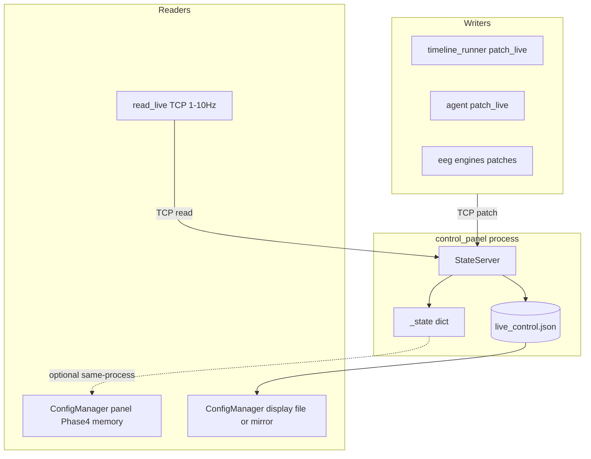

# State bus — full migration plan

This document is the **whole-process** roadmap. It **includes** the lead-authored steps in [state_bus_migration_spec.md](state_bus_migration_spec.md) (IPC `read_live` + `_state` in `StateServer`) and **extends** them with same-process fast reads, subprocess strategy, governance, and verification.

---

## End state (what “done” looks like)

- **Single writer:** All merges/replaces go through `StateServer` (existing `patch_live` / `write_live`).
- **Canonical truth:** `StateServer` holds authoritative `_state` in memory; `live_control.json` is a **projection** (atomic write) for tools, forensics, and processes that are not yet on the bus.
- **Reads:**
  - **Low frequency, any process:** `read_live()` over TCP (`op: "read"`) — per [state_bus_migration_spec.md](state_bus_migration_spec.md).
  - **Control panel (same process as `StateServer`):** optional **direct** access to the same store (no TCP, no file) via pluggable `ConfigManager` live source — see Phase 4.
  - **Display subprocess:** either keep file-backed `ConfigManager` until Phase 5, or a **mirror thread** + in-memory source (no per-frame TCP).
- **No silent bypass:** Direct `live_control.json` writes outside `StateServer` are treated as bugs (audit after migration).

---

## Phase 1 — Foundation (execute per lead spec)

**Source of truth for code snippets:** [state_bus_migration_spec.md](state_bus_migration_spec.md) Steps 1–2 and `ipc/__init__.py` export.

Summary (must match spec behavior):

1. **`ipc/state_server.py`**
   - Add `self._state`, seed from `live_control.json` on init.
   - `_apply_patch` / `_apply_write` update `_state` under lock, then `_atomic_write(self._state)` (or equivalent) so file mirrors memory.
   - Handle `op == "read"`: respond with one NDJSON line of `json.dumps(self._state)`.

2. **`ipc/state_client.py`**
   - `StateClient.read()` — new blocking connection, send `{"op":"read"}`, read until `\n`, `json.loads`, retry with backoff; return `{}` on failure.
   - Module-level `read_live()` delegating to `_get_client().read()`.
   - Use `try` / `finally` (or context manager) so sockets are always closed on each attempt (small fix on top of spec pseudocode).

3. **`ipc/__init__.py`**
   - Export `read_live`.

**Correction vs spec prose:** Today’s server **re-reads the file on every patch**; after Phase 1, **`_state` is canonical**. The spec’s Step 1 is the intended behavior.

**Honest limitation:** If bad data is **on disk** at server start, seeding still loads it. `read_live` fixes cross-reader / interleaved-write staleness, not “bad persisted file” unless you add a separate startup policy later.

---

## Phase 2 — Migrate low-frequency file readers to `read_live()`

**Per spec Step 3**, replace direct `Path(...)/live_control.json` + `json.loads` with `from ipc import read_live` / `read_live()`:

| File | Notes |
|------|--------|
| [engines/haptic_engine.py](../engines/haptic_engine.py) | `_read_live` static |
| [engines/tavns_engine.py](../engines/tavns_engine.py) | same pattern |
| [agent/somna_agent.py](../agent/somna_agent.py) | `SomnaAgent._read_live` |
| [engines/crossmodal_gain.py](../engines/crossmodal_gain.py) | any direct read |
| [session/conductor.py](../session/conductor.py) | any direct read |
| [engines/freq_leader.py](../engines/freq_leader.py) | any direct read |
| [tools/mcp_somna_server.py](../tools/mcp_somna_server.py) | prefer `read_live`; **if `ipc` not importable** from MCP cwd, keep file read + comment (spec 3g) |

**Spec Step 4 / timeline:** [session/timeline_runner.py](../session/timeline_runner.py) — audit direct reads; if any, migrate (low frequency). Writes stay `patch_live`.

**Grep pass:** After Phase 2, ripgrep for `live_control.json` + `read_text` / `open(` in Python should shrink; remaining hits are intentional (Phase 3–5, tests, runners, fallbacks).

---

## Phase 3 — Spec “DO NOT TOUCH” vs reality

Original spec **out of scope** for the **first** reader migration:

- [config.py](../config.py) — no switch to `read_live()` from render loop.
- [visual_display.py](../visual_display.py) — no structural change in Phase 2–3.

**Clarification for this full plan:** `ConfigManager.update()` is called every frame from [visual_display.py](../visual_display.py), but **disk work is already throttled** (~100 ms poll + mtime). “60fps” risk is **not** RAM vs disk; it is **avoid synchronous `read_live()` TCP+JSON every frame** in the display process.

---

## Phase 4 — Control panel: in-process live source (optional but recommended)

**Goal:** [control_panel_imgui.py](../control_panel_imgui.py) runs `StateServer` in-process; its `ConfigManager` instances do not need TCP or file to see live keys.

**Approach:**

- Introduce a small **thread-safe store** (or expose `StateServer.snapshot()` / shared `LiveStateStore` constructed in `__init__` and passed into `StateServer`).
- Extend [config.py](../config.py) with a pluggable **live source**:
  - **Default:** current file + mtime behavior (unchanged for [visual_display.py](../visual_display.py)).
  - **Memory:** same merge rules, driven by a **generation counter** or snapshot hash bumped when `StateServer` applies a patch (no TCP).
- In `ControlPanelImGui.__init__`, pass the memory source into **both** panel `ConfigManager` uses (including `~494` audio cfg).

**Files:** [ipc/state_server.py](../ipc/state_server.py), [config.py](../config.py), [control_panel_imgui.py](../control_panel_imgui.py).

This phase **supersedes** “panel reads through StateServer via its own direct access” from the old spec Step 4 where that was listed as “DO NOT TOUCH” — the panel becomes explicitly store-backed.

---

## Phase 5 — Display subprocess: off the critical file path (later)

**Constraint:** [visual_display_runner.py](../visual_display_runner.py) is a **separate process**; it cannot use the panel’s Python object without IPC.

**Option A (minimal):** Keep file-backed `ConfigManager()` in the display; relies on `StateServer` still atomically writing `live_control.json`. Lowest risk.

**Option B (recommended follow-up):** Background **mirror thread** in the display process: one long-lived TCP connection to `StateServer`, receive **pushes** or infrequent full snapshots (protocol extension beyond spec’s request/response `read`). Main thread’s `ConfigManager` uses **memory live source** fed by that mirror — still **no** per-frame `read_live()` storm.

**Option C (advanced):** mmap / shared memory for zero-copy cross-process blob; larger design.

---

## Phase 6 — Governance and cleanup

- **Audit direct writers:** Any code path that still does `json.dump` to `live_control.json` without going through `StateServer` can desync `_state` from disk. List, fix, or document (MCP fallback only).
- **Agent subprocess:** Reads → `read_live()` once Phase 2 lands (agent runs while panel up); same mirror idea if agent ever needs high-rate reads.
- **VR:** [vr/vr_display_runner.py](../vr/vr_display_runner.py) and related — same taxonomy as display: file until mirror or mmap.
- **Docs:** Keep [state_bus_migration_spec.md](state_bus_migration_spec.md) as the **IPC slice**; this file is the **master checklist**. Optionally add one line at the top of the spec pointing here.

---

## Phase 7 — Testing (merge spec Step 5 + extras)

1. `python -c "from ipc import read_live; print(read_live())"` — with panel running, non-empty dict when state exists.
2. Control panel start/stop, no regressions.
3. Agent subprocess + session timeline + display subprocess smoke.
4. Haptic / Lovense path if available.
5. `python smoke_test.py`
6. After Phase 4: confirm panel UI still tracks live keys with **no** reliance on disk for same-process reads.
7. After Phase 5B: soak run with display + rapid patches, watch CPU (no connect storm).

---

## Execution order (recommended)

| Order | Phase | Delivers |
|------|--------|----------|
| 1 | Phase 1 | `_state` + `read` op + `read_live()` |
| 2 | Phase 2 | Fewer stale file reads system-wide |
| 3 | Phase 7 (subset) | Smoke + manual checks |
| 4 | Phase 4 | Panel memory live source |
| 5 | Phase 6 | Writer audit |
| 6 | Phase 5 | Display mirror (optional) |
| 7 | Phase 7 (full) | Full regression |

---

## Invariants (do not break)

- `patch_live()` / `write_live()` external semantics unchanged.
- `read_live()` returns `{}` when server unreachable (spec).
- New connection per `read_live()` is acceptable **only** at low Hz; not for per-frame display.

---

## Reference

- IPC micro-spec (Steps 1–5, file list, test list): [state_bus_migration_spec.md](state_bus_migration_spec.md)
